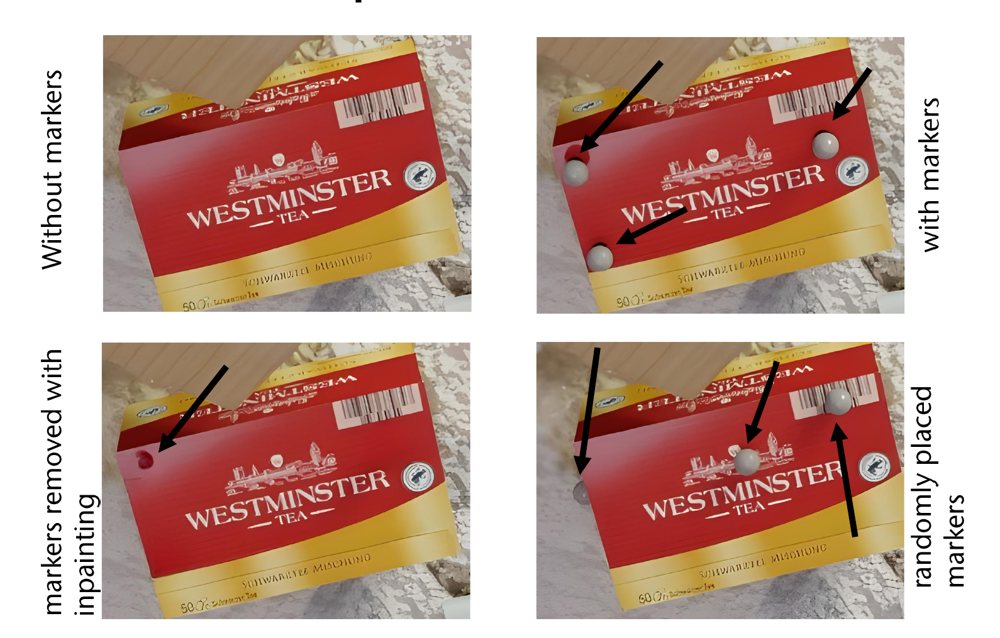

# Effects of Markers in Training Datasets on the Accuracy of 6D Pose Estimation

This repository contains scripts from the paper **Effects of Markers in Training Datasets on the Accuracy of 6D Pose Estimation** presented at WACV 2024.

<p align="center"> <a href="https://openaccess.thecvf.com/content/WACV2024/papers/Rosskamp_Effects_of_Markers_in_Training_Datasets_on_the_Accuracy_of_WACV_2024_paper.pdf">Paper</a> | <a href="https://cgvr.informatik.uni-bremen.de/research/6d_pose_tools/">Project Site </a> | <a href="https://cgvr.informatik.uni-bremen.de/papers/wacv24/wacv24-poster.pdf">Poster</a>
</p>

Collecting training data for pose estimation methods on images is a time-consuming task and usually involves some kind of manual labeling of the 6D pose of objects. This time could be reduced considerably by using marker-based tracking that would allow for automatic labeling of training images. However, images containing markers may reduce the accuracy of pose estimation due to a bias introduced by the markers.

In our paper, we analyze the influence of markers in training images 
on pose estimation accuracy. We investigate the accuracy of estimated poses by comparing with the markerless baseline.

We demonstrate that utilizing marker-based techniques is an effective strategy for collecting large amounts of ground truth data for
pose prediction without loss of performance. For more details, we refer to the paper.

<p align="center">

</p>

## Dataset

The images used for training, can be downloaded from our [project site](https://cgvr.informatik.uni-bremen.de/research/6d_pose_tools/). This includes images with markers, without markers, and inpainted images. 

If you want to create your own dataset, we uploaded the neccessary scripts in this repository.

### Render Images
To create identical scenes with and without markers we used BlenderProc. Download and install [BlenderProc](https://github.com/DLR-RM/BlenderProc) and use the scripts 
- ```main_ycbv_random.py``` to create images with or without markers
- ```main_ycbv_random_marker.py``` to create images with markers for the augmentation method


### Automatically Inpaint Images
To automatically remove markers from images with inpainting we use LaMa. In order to use inpainting we need masks to define areas where the image is inpainted. 

To do this, download and setup the [bop_toolkit](https://github.com/thodan/bop_toolkit). Use ```calc_marker_mask.py``` to generate masks for the markers.

Setup [LaMa](https://github.com/advimman/lama) and copy the bash script to LaMas base directory.

Note: The position of the markers on the object is needed to create the masks!


### Imprecise Ground Truth
To generate imprecise ground truth from known annotations use ```pertubated_scenegt.py```

## 6D Pose Generation Tool
Do you want to create your own automatically annotated datasets from mocap data?

Our program to create 6D pose annotations from mocap data is coming soon!


## Citation

If you find our paper helpful, please cite us:
```bibtex
@InProceedings{Rosskamp_2024_WACV,
    author    = {Rosskamp, Janis and Weller, Rene and Zachmann, Gabriel},
    title     = {Effects of Markers in Training Datasets on the Accuracy of 6D Pose Estimation},
    booktitle = {Proceedings of the IEEE/CVF Winter Conference on Applications of Computer Vision (WACV)},
    month     = {January},
    year      = {2024},
    pages     = {4457-4466}
}
```